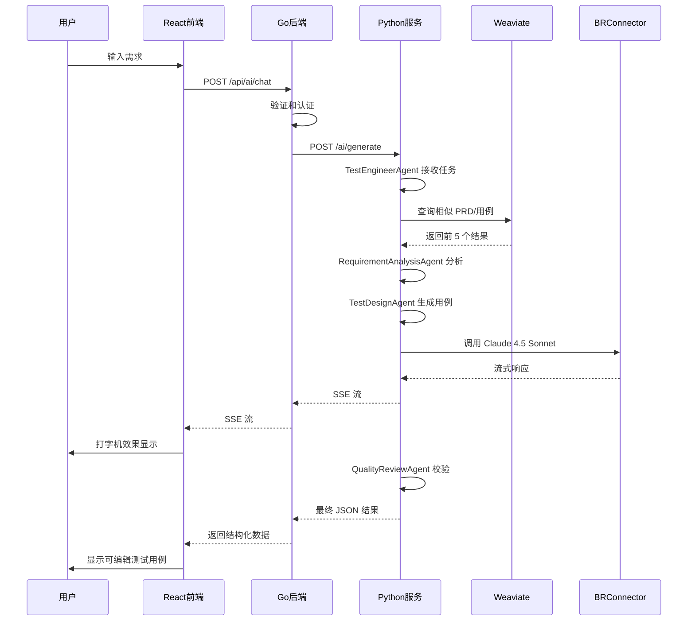

# AI 测试助手设计文档

## 概述

AI 测试助手（ai-test-assistant）是一个基于 LangChain 和 Claude 4.5 Sonnet 的智能测试用例生成系统。系统采用 Agent + Skills + Tools 架构，在现有的 Go + React 测试用例知识库管理系统基础上，新增 AI 对话能力和自动化测试用例生成功能。

### 系统架构

系统采用五层逻辑架构：

1. **接口层**：React 前端 UI + Go REST API
2. **智能决策层**：TestEngineerAgent + Subagents（需求分析、测试设计、质量审查）
3. **能力编排层**：Skills（测试用例生成、影响分析、回归推荐、用例补全）
4. **能力执行层**：Tools（检索、理解、生成、校验、存储）
5. **知识与数据层**：PostgreSQL + Weaviate + BRConnector API

### 技术栈

- **前端**: React 18 + TypeScript 4.9 + Ant Design 5.x
- **Go 后端**: Go 1.21 + Gin + GORM
- **Python AI 服务**: Python 3.11 + FastAPI 0.104 + LangChain 0.1.x
- **LLM**: Claude 4.5 Sonnet (通过 BRConnector)
- **向量数据库**: Weaviate 1.22
- **数据库**: PostgreSQL 15
- **Embedding**: 火山引擎 Embedding API (2048 维)

## 架构

### 系统组件图

```
┌─────────────────────────────────────────────────────────────┐
│                     前端 (React)                            │
│  ┌──────────────┐  ┌──────────────┐  ┌──────────────┐     │
│  │ AI 对话页面  │  │ 测试用例     │  │ 其他页面     │     │
│  │              │  │ 编辑器       │  │              │     │
│  └──────────────┘  └──────────────┘  └──────────────┘     │
└─────────────────────────────────────────────────────────────┘
                            │ HTTP/SSE
┌─────────────────────────────────────────────────────────────┐
│                   Go 后端 (API 网关)                        │
│  ┌──────────────┐  ┌──────────────┐  ┌──────────────┐     │
│  │ AI Handler   │  │ 认证         │  │ 其他         │     │
│  │              │  │ 中间件       │  │ Handlers     │     │
│  └──────────────┘  └──────────────┘  └──────────────┘     │
└─────────────────────────────────────────────────────────────┘
                            │ HTTP
┌─────────────────────────────────────────────────────────────┐
│              Python AI 服务 (FastAPI)                       │
│  ┌──────────────────────────────────────────────────────┐  │
│  │              TestEngineerAgent                       │  │
│  │  ┌────────────┐ ┌────────────┐ ┌────────────┐      │  │
│  │  │ 需求分析   │ │ 测试设计   │ │ 质量       │      │  │
│  │  │ Agent      │ │ Agent      │ │ 审查Agent  │      │  │
│  │  └────────────┘ └────────────┘ └────────────┘      │  │
│  └──────────────────────────────────────────────────────┘  │
│  ┌──────────────────────────────────────────────────────┐  │
│  │                    Skills 层                         │  │
│  │  ┌────────────┐ ┌────────────┐ ┌────────────┐      │  │
│  │  │ 测试用例   │ │ 影响       │ │ 回归       │      │  │
│  │  │ 生成       │ │ 分析       │ │ 推荐       │      │  │
│  │  └────────────┘ └────────────┘ └────────────┘      │  │
│  └──────────────────────────────────────────────────────┘  │
│  ┌──────────────────────────────────────────────────────┐  │
│  │                    Tools 层                          │  │
│  │  ┌────────┐ ┌────────┐ ┌────────┐ ┌────────┐       │  │
│  │  │检索    │ │解析    │ │生成    │ │校验    │       │  │
│  │  │Tools   │ │Tools   │ │Tools   │ │Tools   │       │  │
│  │  └────────┘ └────────┘ └────────┘ └────────┘       │  │
│  └──────────────────────────────────────────────────────┘  │
└─────────────────────────────────────────────────────────────┘
         │                    │                    │
         ▼                    ▼                    ▼
┌──────────────┐    ┌──────────────┐    ┌──────────────┐
│  PostgreSQL  │    │   Weaviate   │    │ BRConnector  │
│              │    │  (向量库)    │    │   (Claude)   │
└──────────────┘    └──────────────┘    └──────────────┘
```


### 请求流程

#### 测试用例生成流程



## 组件和接口

### 1. 前端组件 (React + TypeScript)

#### 1.1 AI 对话页面组件

**位置**: `frontend/src/pages/AIAssistant/index.tsx`

**职责**:
- 渲染带有消息历史的对话界面
- 处理用户输入和消息提交
- 以打字机效果显示流式响应
- 管理对话状态

**关键接口**:

```typescript
interface Message {
  id: string;
  role: 'user' | 'assistant';
  content: string;
  timestamp: Date;
  streaming?: boolean;
}

interface ChatPageProps {
  projectId?: string;
}

interface ChatPageState {
  messages: Message[];
  inputValue: string;
  isLoading: boolean;
  error?: string;
}
```

#### 1.2 对话框组件

**位置**: `frontend/src/components/ChatBox/index.tsx`

**职责**:
- 显示单个消息
- 处理流式文本渲染
- 支持消息操作（复制、重新生成）

**关键接口**:

```typescript
interface ChatBoxProps {
  messages: Message[];
  onSendMessage: (content: string) => void;
  isLoading: boolean;
}
```

#### 1.3 测试用例编辑器组件

**位置**: `frontend/src/components/TestCaseEditor/index.tsx`

**职责**:
- 以可编辑形式显示 AI 生成的测试用例
- 验证测试用例字段
- 提交测试用例到后端保存

**关键接口**:

```typescript
interface GeneratedTestCase {
  title: string;
  preconditions: string;
  steps: TestStep[];
  expectedResult: string;
  priority: 'high' | 'medium' | 'low';
  type: 'functional' | 'boundary' | 'exception';
}

interface TestCaseEditorProps {
  testCases: GeneratedTestCase[];
  onSave: (testCases: GeneratedTestCase[]) => Promise<void>;
  onCancel: () => void;
}
```

### 2. Go 后端组件

#### 2.1 AI Handler

**位置**: `backend/internal/api/handler/ai_handler.go`

**职责**:
- 处理 AI 对话 API 请求
- 转发请求到 Python AI 服务
- 流式返回响应到前端
- 处理错误和超时

**关键接口**:

```go
type AIHandler struct {
    aiService *ai.Service
    logger    *zap.Logger
}

type ChatRequest struct {
    Message       string `json:"message" binding:"required"`
    ConversationID string `json:"conversation_id"`
    ProjectID     uint   `json:"project_id"`
}

type ChatResponse struct {
    ConversationID string          `json:"conversation_id"`
    Message        string          `json:"message"`
    TestCases      []GeneratedCase `json:"test_cases,omitempty"`
}

type GeneratedCase struct {
    Title          string     `json:"title"`
    Preconditions  string     `json:"preconditions"`
    Steps          []TestStep `json:"steps"`
    ExpectedResult string     `json:"expected_result"`
    Priority       string     `json:"priority"`
    Type           string     `json:"type"`
}
```

**API 端点**:

```
POST   /api/ai/chat              - 发送消息到 AI
GET    /api/ai/chat/stream       - 流式 AI 响应 (SSE)
POST   /api/ai/test-cases/save   - 保存生成的测试用例
GET    /api/ai/conversations     - 列出对话
DELETE /api/ai/conversations/:id - 删除对话
```

#### 2.2 AI Service

**位置**: `backend/internal/service/ai/ai_service.go`

**职责**:
- 与 Python AI 服务通信
- 处理连接池
- 实现重试逻辑
- 转换响应

**关键接口**:

```go
type Service struct {
    pythonServiceURL string
    httpClient       *http.Client
    logger           *zap.Logger
}

type GenerateRequest struct {
    Message        string `json:"message"`
    ConversationID string `json:"conversation_id"`
    ProjectID      uint   `json:"project_id"`
}

type GenerateResponse struct {
    ConversationID string          `json:"conversation_id"`
    Response       string          `json:"response"`
    TestCases      []GeneratedCase `json:"test_cases"`
}
```


### 3. Python AI 服务组件

#### 3.1 FastAPI 应用

**位置**: `ai-service/main.py`

**职责**:
- 初始化 FastAPI 应用
- 配置 CORS 和中间件
- 注册 API 路由
- 初始化 Agent 和 Skills

**关键接口**:

```python
from fastapi import FastAPI
from fastapi.middleware.cors import CORSMiddleware

app = FastAPI(title="AI Test Assistant Service")

@app.post("/ai/generate")
async def generate_test_cases(request: GenerateRequest) -> GenerateResponse:
    """基于需求描述生成测试用例"""
    pass

@app.post("/ai/chat/stream")
async def chat_stream(request: ChatRequest) -> StreamingResponse:
    """使用 SSE 流式传输 AI 响应"""
    pass

@app.get("/health")
async def health_check() -> dict:
    """健康检查端点"""
    return {"status": "healthy"}
```

#### 3.2 Agent 层

##### 3.2.1 TestEngineerAgent (主 Agent)

**位置**: `ai-service/app/agent/test_engineer_agent.py`

**角色**: 模拟高级测试工程师，负责整体任务理解、决策与协调

**职责**:
- 理解用户输入（需求、变更、问题）
- 确定任务类型（生成用例 / 影响分析 / 回归推荐）
- 选择合适的 Skill 执行
- 决定是否调用 Subagents
- 对最终结果进行质量保证

**关键接口**:

```python
from langchain.agents import AgentExecutor
from langchain.chat_models import ChatAnthropic
from langchain.prompts import ChatPromptTemplate

class TestEngineerAgent:
    def __init__(self, llm: ChatAnthropic, skills: List[Skill], tools: List[Tool]):
        self.llm = llm
        self.skills = skills
        self.tools = tools
        self.agent_executor = self._create_agent_executor()
    
    async def process_request(self, message: str, context: dict) -> AgentResponse:
        """Process user request and coordinate execution"""
        # 1. Understand task type
        task_type = await self._classify_task(message)
        
        # 2. Select appropriate skill
        skill = self._select_skill(task_type)
        
        # 3. Execute skill with subagents if needed
        result = await skill.execute(message, context)
        
        # 4. Quality assurance
        validated_result = await self._validate_result(result)
        
        return validated_result
    
    async def _classify_task(self, message: str) -> TaskType:
        """Classify user request into task types"""
        pass
    
    def _select_skill(self, task_type: TaskType) -> Skill:
        """Select appropriate skill based on task type"""
        pass
    
    async def _validate_result(self, result: Any) -> AgentResponse:
        """Validate and ensure quality of results"""
        pass
```

**Prompt Template**:

```python
SYSTEM_PROMPT = """You are a senior test engineer with 10+ years of experience.
Your role is to understand testing requirements, design comprehensive test cases,
and ensure quality through systematic analysis.

You have access to:
- Historical PRD and test case knowledge base
- Multiple specialized subagents (requirement analysis, test design, quality review)
- Various skills (test case generation, impact analysis, regression recommendation)

Your goal is to provide high-quality, actionable test cases that cover:
- Main flow scenarios
- Exception and error handling
- Boundary value testing
- Edge cases

Always think step-by-step and explain your reasoning."""
```

##### 3.2.2 RequirementAnalysisAgent (Subagent)

**Location**: `ai-service/app/agent/requirement_analysis_agent.py`

**Role**: 需求分析专家

**Responsibilities**:
- Extract functional points from natural language requirements
- Identify business rules and constraints
- Determine input/output specifications
- Identify exception conditions
- Structure requirements for test design

**Key Interfaces**:

```python
class RequirementAnalysisAgent:
    def __init__(self, llm: ChatAnthropic):
        self.llm = llm
        self.prompt = self._create_prompt()
    
    async def analyze(self, requirement: str, context: dict) -> AnalysisResult:
        """Analyze requirement and extract structured information"""
        chain = self.prompt | self.llm
        result = await chain.ainvoke({
            "requirement": requirement,
            "historical_context": context.get("historical_prds", [])
        })
        
        return self._parse_analysis(result)
    
    def _parse_analysis(self, raw_result: str) -> AnalysisResult:
        """Parse LLM output into structured analysis result"""
        pass
```

**Prompt Template**:

```python
REQUIREMENT_ANALYSIS_PROMPT = """You are a requirement analysis expert.
Analyze the following requirement and extract:

1. Functional Points: What features/capabilities are needed?
2. Business Rules: What rules govern the behavior?
3. Input Specifications: What inputs are expected? (format, range, constraints)
4. Output Specifications: What outputs should be produced?
5. Exception Conditions: What error cases should be handled?
6. Constraints: Any performance, security, or other constraints?

Requirement:
{requirement}

Historical Context (similar PRDs):
{historical_context}

Provide your analysis in structured JSON format."""
```

**Output Structure**:

```python
@dataclass
class AnalysisResult:
    functional_points: List[str]
    business_rules: List[str]
    input_specs: Dict[str, Any]
    output_specs: Dict[str, Any]
    exception_conditions: List[str]
    constraints: List[str]
```

##### 3.2.3 TestDesignAgent (Subagent)

**Location**: `ai-service/app/agent/test_design_agent.py`

**Role**: 测试设计专家

**Responsibilities**:
- Generate main flow test scenarios
- Design exception flow test cases
- Identify boundary value test points
- Create combination scenarios
- Design security and performance test points

**Key Interfaces**:

```python
class TestDesignAgent:
    def __init__(self, llm: ChatAnthropic):
        self.llm = llm
        self.prompt = self._create_prompt()
    
    async def design_tests(
        self, 
        analysis: AnalysisResult, 
        historical_cases: List[dict]
    ) -> List[TestCaseDesign]:
        """Design test cases based on requirement analysis"""
        chain = self.prompt | self.llm
        result = await chain.ainvoke({
            "analysis": analysis.to_dict(),
            "historical_cases": historical_cases
        })
        
        return self._parse_test_designs(result)
```

**Prompt Template**:

```python
TEST_DESIGN_PROMPT = """You are a test design expert specializing in comprehensive test coverage.

Based on the requirement analysis, design test cases covering:

1. Main Flow: Happy path scenarios
2. Exception Flow: Error handling and edge cases
3. Boundary Values: Min, max, and boundary conditions
4. Combination Scenarios: Multiple conditions interacting
5. Security Tests: Authentication, authorization, input validation
6. Performance Tests: Load, stress, scalability considerations

Requirement Analysis:
{analysis}

Similar Historical Test Cases:
{historical_cases}

For each test case, provide:
- Title: Clear, descriptive name
- Preconditions: Setup required before test
- Test Steps: Numbered, actionable steps
- Expected Result: Clear success criteria
- Priority: High/Medium/Low
- Type: Functional/Boundary/Exception/Security/Performance

Output in JSON array format."""
```


**Output Structure**:

```python
@dataclass
class TestCaseDesign:
    title: str
    preconditions: str
    steps: List[str]
    expected_result: str
    priority: str  # 'high' | 'medium' | 'low'
    type: str  # 'functional' | 'boundary' | 'exception' | 'security' | 'performance'
    rationale: str  # Why this test case is important
```

##### 3.2.4 QualityReviewAgent (Subagent)

**Location**: `ai-service/app/agent/quality_review_agent.py`

**Role**: 质量审查专家

**Responsibilities**:
- Check test coverage completeness
- Validate test case structure
- Detect duplicate test cases
- Verify compliance with standards
- Provide improvement suggestions

**Key Interfaces**:

```python
class QualityReviewAgent:
    def __init__(self, llm: ChatAnthropic):
        self.llm = llm
        self.prompt = self._create_prompt()
    
    async def review(
        self, 
        test_cases: List[TestCaseDesign],
        requirement: str,
        analysis: AnalysisResult
    ) -> ReviewResult:
        """Review test cases for quality and completeness"""
        chain = self.prompt | self.llm
        result = await chain.ainvoke({
            "test_cases": [tc.to_dict() for tc in test_cases],
            "requirement": requirement,
            "analysis": analysis.to_dict()
        })
        
        return self._parse_review(result)
```

**Prompt Template**:

```python
QUALITY_REVIEW_PROMPT = """You are a quality assurance expert reviewing test cases.

Evaluate the test cases against these criteria:

1. Coverage Completeness:
   - Are all functional points covered?
   - Are exception conditions tested?
   - Are boundary values included?

2. Structure Quality:
   - Are titles clear and descriptive?
   - Are preconditions complete?
   - Are steps actionable and numbered?
   - Are expected results specific and measurable?

3. Duplication Check:
   - Are there redundant test cases?
   - Can any cases be merged?

4. Standards Compliance:
   - Do cases follow naming conventions?
   - Is priority assignment appropriate?
   - Are types correctly categorized?

Test Cases:
{test_cases}

Original Requirement:
{requirement}

Requirement Analysis:
{analysis}

Provide:
- Coverage Score (0-100)
- Issues Found (list)
- Improvement Suggestions (list)
- Approved Cases (list of indices)
- Rejected Cases (list of indices with reasons)"""
```

**Output Structure**:

```python
@dataclass
class ReviewResult:
    coverage_score: int  # 0-100
    issues: List[str]
    suggestions: List[str]
    approved_cases: List[int]  # Indices of approved cases
    rejected_cases: List[Tuple[int, str]]  # (index, reason)
    overall_quality: str  # 'excellent' | 'good' | 'needs_improvement'
```

#### 3.3 Skills Layer

##### 3.3.1 TestCaseGenerationSkill (Core Skill)

**Location**: `ai-service/app/skill/test_case_generation_skill.py`

**Purpose**: 完整的测试用例自动生成流程

**Workflow**:
1. Retrieve historical knowledge (PRDs and test cases)
2. Analyze requirement using RequirementAnalysisAgent
3. Design test cases using TestDesignAgent
4. Review quality using QualityReviewAgent
5. Format and return results

**Key Interfaces**:

```python
class TestCaseGenerationSkill(Skill):
    def __init__(
        self,
        requirement_agent: RequirementAnalysisAgent,
        test_design_agent: TestDesignAgent,
        quality_review_agent: QualityReviewAgent,
        tools: Dict[str, Tool]
    ):
        self.requirement_agent = requirement_agent
        self.test_design_agent = test_design_agent
        self.quality_review_agent = quality_review_agent
        self.tools = tools
    
    async def execute(self, requirement: str, context: dict) -> SkillResult:
        """Execute complete test case generation workflow"""
        
        # Step 1: Retrieve historical knowledge
        historical_prds = await self.tools['search_prd'].execute(requirement)
        historical_cases = await self.tools['search_testcase'].execute(requirement)
        
        # Step 2: Analyze requirement
        analysis = await self.requirement_agent.analyze(
            requirement, 
            {"historical_prds": historical_prds}
        )
        
        # Step 3: Design test cases
        test_designs = await self.test_design_agent.design_tests(
            analysis,
            historical_cases
        )
        
        # Step 4: Quality review
        review = await self.quality_review_agent.review(
            test_designs,
            requirement,
            analysis
        )
        
        # Step 5: Filter and format approved cases
        approved_cases = [
            test_designs[i] for i in review.approved_cases
        ]
        
        formatted_cases = await self.tools['format_testcase'].execute(
            approved_cases
        )
        
        return SkillResult(
            test_cases=formatted_cases,
            analysis=analysis,
            review=review,
            metadata={
                "coverage_score": review.coverage_score,
                "total_generated": len(test_designs),
                "approved_count": len(approved_cases)
            }
        )
```

##### 3.3.2 ImpactAnalysisSkill

**Location**: `ai-service/app/skill/impact_analysis_skill.py`

**Purpose**: 分析需求变更对现有测试用例的影响

**Workflow**:
1. Retrieve related PRDs and test cases
2. Compare changes between old and new requirements
3. Identify affected modules and test cases
4. Generate impact report

**Key Interfaces**:

```python
class ImpactAnalysisSkill(Skill):
    async def execute(self, change_description: str, context: dict) -> SkillResult:
        """Analyze impact of requirement changes"""
        
        # Retrieve related PRDs
        related_prds = await self.tools['search_prd'].execute(change_description)
        
        # Get associated test cases
        affected_cases = []
        for prd in related_prds:
            cases = await self.tools['get_related_cases'].execute(prd['id'])
            affected_cases.extend(cases)
        
        # Analyze impact using LLM
        impact_report = await self._analyze_impact(
            change_description,
            related_prds,
            affected_cases
        )
        
        return SkillResult(
            impact_report=impact_report,
            affected_modules=impact_report['modules'],
            affected_cases=impact_report['test_cases']
        )
```

##### 3.3.3 RegressionRecommendationSkill

**Location**: `ai-service/app/skill/regression_recommendation_skill.py`

**Purpose**: 推荐回归测试用例集

**Workflow**:
1. Retrieve historical test cases
2. Analyze module relationships
3. Identify version changes
4. Rank and recommend test cases

**Key Interfaces**:

```python
class RegressionRecommendationSkill(Skill):
    async def execute(self, version_info: dict, context: dict) -> SkillResult:
        """Recommend regression test cases for a version"""
        
        # Get changed modules
        changed_modules = version_info.get('changed_modules', [])
        
        # Retrieve test cases for changed modules
        candidate_cases = []
        for module in changed_modules:
            cases = await self.tools['search_testcase'].execute(
                f"module:{module}"
            )
            candidate_cases.extend(cases)
        
        # Rank cases by priority and risk
        ranked_cases = await self._rank_cases(
            candidate_cases,
            version_info
        )
        
        return SkillResult(
            recommended_cases=ranked_cases[:50],  # Top 50
            total_candidates=len(candidate_cases),
            ranking_criteria=self._get_ranking_criteria()
        )
```


##### 3.3.4 TestCaseOptimizationSkill

**Location**: `ai-service/app/skill/test_case_optimization_skill.py`

**Purpose**: 优化和补全现有测试用例

**Workflow**:
1. Validate existing test case quality
2. Identify missing test points
3. Generate supplementary test cases
4. Provide optimization suggestions

**Key Interfaces**:

```python
class TestCaseOptimizationSkill(Skill):
    async def execute(self, test_case_id: str, context: dict) -> SkillResult:
        """Optimize and supplement existing test case"""
        
        # Retrieve existing test case
        existing_case = await self.tools['get_testcase'].execute(test_case_id)
        
        # Quality check
        quality_issues = await self.tools['check_quality'].execute(existing_case)
        
        # Identify missing test points
        missing_points = await self._identify_gaps(existing_case)
        
        # Generate supplementary cases
        supplements = await self._generate_supplements(
            existing_case,
            missing_points
        )
        
        return SkillResult(
            quality_issues=quality_issues,
            missing_points=missing_points,
            supplementary_cases=supplements,
            optimization_suggestions=self._generate_suggestions(quality_issues)
        )
```

#### 3.4 Tools Layer

##### 3.4.1 Retrieval Tools

**SearchPRDTool**

**Location**: `ai-service/app/tool/search_prd_tool.py`

```python
class SearchPRDTool(Tool):
    """Search PRDs by semantic similarity or conditions"""
    
    def __init__(self, weaviate_client, embedding_service):
        self.weaviate = weaviate_client
        self.embedding = embedding_service
    
    async def execute(self, query: str, limit: int = 5) -> List[dict]:
        """Search PRDs using vector similarity"""
        # Generate embedding for query
        query_vector = await self.embedding.generate(query)
        
        # Query Weaviate
        results = self.weaviate.query.get(
            "PRD",
            ["id", "title", "content", "module", "version"]
        ).with_near_vector({
            "vector": query_vector
        }).with_limit(limit).do()
        
        return results['data']['Get']['PRD']
```

**SearchTestCaseTool**

**Location**: `ai-service/app/tool/search_testcase_tool.py`

```python
class SearchTestCaseTool(Tool):
    """Search test cases by semantic similarity or conditions"""
    
    async def execute(self, query: str, limit: int = 5) -> List[dict]:
        """Search test cases using vector similarity"""
        query_vector = await self.embedding.generate(query)
        
        results = self.weaviate.query.get(
            "TestCase",
            ["id", "title", "preconditions", "steps", "expected_result", "priority"]
        ).with_near_vector({
            "vector": query_vector
        }).with_limit(limit).do()
        
        return results['data']['Get']['TestCase']
```

**GetRelatedCasesTool**

**Location**: `ai-service/app/tool/get_related_cases_tool.py`

```python
class GetRelatedCasesTool(Tool):
    """Get test cases related to a specific PRD"""
    
    def __init__(self, postgres_client):
        self.db = postgres_client
    
    async def execute(self, prd_id: str) -> List[dict]:
        """Query test cases by PRD ID"""
        query = """
            SELECT tc.* 
            FROM test_cases tc
            JOIN prd_testcase_relation ptr ON tc.id = ptr.test_case_id
            WHERE ptr.prd_id = %s
        """
        results = await self.db.fetch(query, prd_id)
        return [dict(row) for row in results]
```

##### 3.4.2 Understanding Tools

**ParseRequirementTool**

**Location**: `ai-service/app/tool/parse_requirement_tool.py`

```python
class ParseRequirementTool(Tool):
    """Parse natural language requirement into structured format"""
    
    def __init__(self, llm: ChatAnthropic):
        self.llm = llm
    
    async def execute(self, requirement: str) -> dict:
        """Parse requirement using LLM"""
        prompt = f"""Parse the following requirement into structured JSON:
        
        Requirement: {requirement}
        
        Extract:
        - feature_name: string
        - description: string
        - functional_points: array of strings
        - constraints: array of strings
        - acceptance_criteria: array of strings
        """
        
        result = await self.llm.ainvoke(prompt)
        return json.loads(result.content)
```

**ExtractTestPointsTool**

**Location**: `ai-service/app/tool/extract_test_points_tool.py`

```python
class ExtractTestPointsTool(Tool):
    """Extract test points from requirement analysis"""
    
    async def execute(self, analysis: AnalysisResult) -> List[TestPoint]:
        """Extract testable points from analysis"""
        test_points = []
        
        # Extract from functional points
        for fp in analysis.functional_points:
            test_points.append(TestPoint(
                type='functional',
                description=fp,
                priority='high'
            ))
        
        # Extract from exception conditions
        for ec in analysis.exception_conditions:
            test_points.append(TestPoint(
                type='exception',
                description=ec,
                priority='medium'
            ))
        
        # Extract boundary values from input specs
        for input_name, spec in analysis.input_specs.items():
            if 'range' in spec:
                test_points.append(TestPoint(
                    type='boundary',
                    description=f"Test {input_name} at boundaries: {spec['range']}",
                    priority='high'
                ))
        
        return test_points
```

##### 3.4.3 Generation Tools

**GenerateTestCaseTool**

**Location**: `ai-service/app/tool/generate_testcase_tool.py`

```python
class GenerateTestCaseTool(Tool):
    """Generate test case from test point"""
    
    def __init__(self, llm: ChatAnthropic):
        self.llm = llm
    
    async def execute(
        self, 
        test_point: TestPoint,
        context: dict
    ) -> TestCaseDesign:
        """Generate detailed test case from test point"""
        prompt = f"""Generate a detailed test case for:
        
        Test Point: {test_point.description}
        Type: {test_point.type}
        Priority: {test_point.priority}
        
        Context:
        {json.dumps(context, indent=2)}
        
        Provide:
        - title: Clear, specific title
        - preconditions: Setup required
        - steps: Numbered, actionable steps
        - expected_result: Specific, measurable outcome
        
        Output as JSON."""
        
        result = await self.llm.ainvoke(prompt)
        return TestCaseDesign.from_json(result.content)
```

**FormatTestCaseTool**

**Location**: `ai-service/app/tool/format_testcase_tool.py`

```python
class FormatTestCaseTool(Tool):
    """Format test case to system standard structure"""
    
    async def execute(self, test_cases: List[TestCaseDesign]) -> List[dict]:
        """Format test cases to match database schema"""
        formatted = []
        
        for tc in test_cases:
            formatted.append({
                "title": tc.title,
                "preconditions": tc.preconditions,
                "steps": [
                    {"step_number": i+1, "action": step, "expected": ""}
                    for i, step in enumerate(tc.steps)
                ],
                "expected_result": tc.expected_result,
                "priority": tc.priority,
                "type": tc.type,
                "status": "draft"
            })
        
        return formatted
```

##### 3.4.4 Validation Tools

**ValidateCoverageTool**

**Location**: `ai-service/app/tool/validate_coverage_tool.py`

```python
class ValidateCoverageTool(Tool):
    """Check test coverage completeness"""
    
    async def execute(
        self,
        test_cases: List[TestCaseDesign],
        analysis: AnalysisResult
    ) -> CoverageReport:
        """Validate coverage against requirement analysis"""
        
        covered_points = set()
        uncovered_points = set()
        
        # Check functional point coverage
        for fp in analysis.functional_points:
            if any(fp.lower() in tc.title.lower() for tc in test_cases):
                covered_points.add(fp)
            else:
                uncovered_points.add(fp)
        
        # Check exception coverage
        exception_coverage = sum(
            1 for tc in test_cases if tc.type == 'exception'
        ) / max(len(analysis.exception_conditions), 1)
        
        # Check boundary coverage
        boundary_coverage = sum(
            1 for tc in test_cases if tc.type == 'boundary'
        ) / max(len(analysis.input_specs), 1)
        
        return CoverageReport(
            overall_score=len(covered_points) / max(len(analysis.functional_points), 1) * 100,
            covered_points=list(covered_points),
            uncovered_points=list(uncovered_points),
            exception_coverage=exception_coverage * 100,
            boundary_coverage=boundary_coverage * 100
        )
```

**CheckDuplicationTool**

**Location**: `ai-service/app/tool/check_duplication_tool.py`

```python
class CheckDuplicationTool(Tool):
    """Detect duplicate test cases"""
    
    async def execute(self, test_cases: List[TestCaseDesign]) -> List[Tuple[int, int]]:
        """Find duplicate or highly similar test cases"""
        duplicates = []
        
        for i in range(len(test_cases)):
            for j in range(i+1, len(test_cases)):
                similarity = self._calculate_similarity(
                    test_cases[i],
                    test_cases[j]
                )
                if similarity > 0.85:  # 85% similarity threshold
                    duplicates.append((i, j))
        
        return duplicates
    
    def _calculate_similarity(self, tc1: TestCaseDesign, tc2: TestCaseDesign) -> float:
        """Calculate similarity score between two test cases"""
        # Use simple text similarity for now
        # Could be enhanced with embedding-based similarity
        from difflib import SequenceMatcher
        
        title_sim = SequenceMatcher(None, tc1.title, tc2.title).ratio()
        steps_sim = SequenceMatcher(
            None, 
            ' '.join(tc1.steps), 
            ' '.join(tc2.steps)
        ).ratio()
        
        return (title_sim + steps_sim) / 2
```


**CheckQualityTool**

**Location**: `ai-service/app/tool/check_quality_tool.py`

```python
class CheckQualityTool(Tool):
    """Execute quality rules validation"""
    
    async def execute(self, test_case: TestCaseDesign) -> List[QualityIssue]:
        """Check test case against quality rules"""
        issues = []
        
        # Rule 1: Title should be clear and specific
        if len(test_case.title) < 10:
            issues.append(QualityIssue(
                severity='warning',
                rule='title_length',
                message='Title is too short, should be more descriptive'
            ))
        
        # Rule 2: Should have preconditions
        if not test_case.preconditions or len(test_case.preconditions) < 5:
            issues.append(QualityIssue(
                severity='error',
                rule='missing_preconditions',
                message='Preconditions are missing or incomplete'
            ))
        
        # Rule 3: Should have at least 2 steps
        if len(test_case.steps) < 2:
            issues.append(QualityIssue(
                severity='warning',
                rule='insufficient_steps',
                message='Test case should have at least 2 steps'
            ))
        
        # Rule 4: Expected result should be specific
        if not test_case.expected_result or len(test_case.expected_result) < 10:
            issues.append(QualityIssue(
                severity='error',
                rule='vague_expected_result',
                message='Expected result should be specific and measurable'
            ))
        
        # Rule 5: Steps should be actionable
        for i, step in enumerate(test_case.steps):
            if not any(verb in step.lower() for verb in ['click', 'enter', 'select', 'verify', 'check']):
                issues.append(QualityIssue(
                    severity='info',
                    rule='actionable_steps',
                    message=f'Step {i+1} may not be actionable enough'
                ))
        
        return issues
```

##### 3.4.5 Storage Tools

**SaveTestCaseTool**

**Location**: `ai-service/app/tool/save_testcase_tool.py`

```python
class SaveTestCaseTool(Tool):
    """Save new test case to database"""
    
    def __init__(self, postgres_client, weaviate_client, embedding_service):
        self.db = postgres_client
        self.weaviate = weaviate_client
        self.embedding = embedding_service
    
    async def execute(self, test_case: dict, project_id: int) -> str:
        """Save test case to PostgreSQL and Weaviate"""
        
        # Save to PostgreSQL
        query = """
            INSERT INTO test_cases 
            (title, preconditions, expected_result, priority, type, project_id, status)
            VALUES (%s, %s, %s, %s, %s, %s, %s)
            RETURNING id
        """
        test_case_id = await self.db.fetchval(
            query,
            test_case['title'],
            test_case['preconditions'],
            test_case['expected_result'],
            test_case['priority'],
            test_case['type'],
            project_id,
            'draft'
        )
        
        # Save steps
        for step in test_case['steps']:
            await self.db.execute(
                """INSERT INTO test_steps 
                   (test_case_id, step_number, action, expected)
                   VALUES (%s, %s, %s, %s)""",
                test_case_id,
                step['step_number'],
                step['action'],
                step.get('expected', '')
            )
        
        # Generate embedding and save to Weaviate
        content = f"{test_case['title']} {test_case['preconditions']} {test_case['expected_result']}"
        embedding = await self.embedding.generate(content)
        
        self.weaviate.data_object.create(
            data_object={
                "testCaseId": str(test_case_id),
                "title": test_case['title'],
                "content": content,
                "priority": test_case['priority'],
                "type": test_case['type']
            },
            class_name="TestCase",
            vector=embedding
        )
        
        return str(test_case_id)
```

**UpdateTestCaseTool**

**Location**: `ai-service/app/tool/update_testcase_tool.py`

```python
class UpdateTestCaseTool(Tool):
    """Update existing test case"""
    
    async def execute(self, test_case_id: str, updates: dict) -> bool:
        """Update test case in PostgreSQL and Weaviate"""
        
        # Update PostgreSQL
        set_clauses = []
        values = []
        for key, value in updates.items():
            if key != 'steps':  # Handle steps separately
                set_clauses.append(f"{key} = %s")
                values.append(value)
        
        if set_clauses:
            query = f"""
                UPDATE test_cases 
                SET {', '.join(set_clauses)}
                WHERE id = %s
            """
            values.append(test_case_id)
            await self.db.execute(query, *values)
        
        # Update steps if provided
        if 'steps' in updates:
            await self.db.execute(
                "DELETE FROM test_steps WHERE test_case_id = %s",
                test_case_id
            )
            for step in updates['steps']:
                await self.db.execute(
                    """INSERT INTO test_steps 
                       (test_case_id, step_number, action, expected)
                       VALUES (%s, %s, %s, %s)""",
                    test_case_id,
                    step['step_number'],
                    step['action'],
                    step.get('expected', '')
                )
        
        # Update Weaviate
        # (Implementation depends on Weaviate update strategy)
        
        return True
```

#### 3.5 Integration Services

##### 3.5.1 BRConnector Client

**Location**: `ai-service/app/integration/brconnector_client.py`

```python
from anthropic import AsyncAnthropic

class BRConnectorClient:
    """Client for BRConnector API (Claude 4.5 Sonnet)"""
    
    def __init__(self, api_key: str, base_url: str):
        self.client = AsyncAnthropic(
            api_key=api_key,
            base_url=base_url
        )
        self.model = "claude-4-5-sonnet"
    
    async def chat(
        self,
        messages: List[dict],
        system: str = "",
        temperature: float = 0.7,
        max_tokens: int = 4096
    ) -> str:
        """Send chat request to Claude"""
        response = await self.client.messages.create(
            model=self.model,
            system=system,
            messages=messages,
            temperature=temperature,
            max_tokens=max_tokens
        )
        return response.content[0].text
    
    async def chat_stream(
        self,
        messages: List[dict],
        system: str = "",
        temperature: float = 0.7,
        max_tokens: int = 4096
    ):
        """Stream chat response from Claude"""
        async with self.client.messages.stream(
            model=self.model,
            system=system,
            messages=messages,
            temperature=temperature,
            max_tokens=max_tokens
        ) as stream:
            async for text in stream.text_stream:
                yield text
```

##### 3.5.2 Embedding Service

**Location**: `ai-service/app/integration/embedding_service.py`

```python
import httpx

class VolcanoEmbeddingService:
    """Client for Volcano Engine Embedding API"""
    
    def __init__(self, api_key: str, endpoint: str):
        self.api_key = api_key
        self.endpoint = endpoint
        self.dimension = 2048
    
    async def generate(self, text: str) -> List[float]:
        """Generate embedding vector for text"""
        async with httpx.AsyncClient() as client:
            response = await client.post(
                self.endpoint,
                headers={
                    "Authorization": f"Bearer {self.api_key}",
                    "Content-Type": "application/json"
                },
                json={
                    "input": text,
                    "model": "embedding-2048"
                },
                timeout=30.0
            )
            response.raise_for_status()
            data = response.json()
            return data['data'][0]['embedding']
    
    async def generate_batch(self, texts: List[str]) -> List[List[float]]:
        """Generate embeddings for multiple texts"""
        async with httpx.AsyncClient() as client:
            response = await client.post(
                self.endpoint,
                headers={
                    "Authorization": f"Bearer {self.api_key}",
                    "Content-Type": "application/json"
                },
                json={
                    "input": texts,
                    "model": "embedding-2048"
                },
                timeout=60.0
            )
            response.raise_for_status()
            data = response.json()
            return [item['embedding'] for item in data['data']]
```

##### 3.5.3 Weaviate Client

**Location**: `ai-service/app/integration/weaviate_client.py`

```python
import weaviate

class WeaviateClient:
    """Client for Weaviate vector database"""
    
    def __init__(self, url: str):
        self.client = weaviate.Client(url)
    
    async def search_similar(
        self,
        class_name: str,
        query_vector: List[float],
        limit: int = 5,
        fields: List[str] = None
    ) -> List[dict]:
        """Search for similar objects by vector"""
        if fields is None:
            fields = ["*"]
        
        result = (
            self.client.query
            .get(class_name, fields)
            .with_near_vector({"vector": query_vector})
            .with_limit(limit)
            .do()
        )
        
        return result['data']['Get'][class_name]
```


## Data Models

### Frontend Data Models

```typescript
// Message in chat conversation
interface Message {
  id: string;
  role: 'user' | 'assistant';
  content: string;
  timestamp: Date;
  streaming?: boolean;
  testCases?: GeneratedTestCase[];
}

// Generated test case from AI
interface GeneratedTestCase {
  title: string;
  preconditions: string;
  steps: TestStep[];
  expectedResult: string;
  priority: 'high' | 'medium' | 'low';
  type: 'functional' | 'boundary' | 'exception' | 'security' | 'performance';
}

// Test step
interface TestStep {
  stepNumber: number;
  action: string;
  expected: string;
}

// Conversation metadata
interface Conversation {
  id: string;
  projectId?: number;
  title: string;
  createdAt: Date;
  updatedAt: Date;
  messageCount: number;
}
```

### Backend Data Models (Go)

```go
// AI chat request
type ChatRequest struct {
    Message        string `json:"message" binding:"required"`
    ConversationID string `json:"conversation_id"`
    ProjectID      uint   `json:"project_id"`
    Stream         bool   `json:"stream"`
}

// AI chat response
type ChatResponse struct {
    ConversationID string          `json:"conversation_id"`
    Message        string          `json:"message"`
    TestCases      []GeneratedCase `json:"test_cases,omitempty"`
    Metadata       ResponseMetadata `json:"metadata"`
}

// Generated test case
type GeneratedCase struct {
    Title          string     `json:"title"`
    Preconditions  string     `json:"preconditions"`
    Steps          []TestStep `json:"steps"`
    ExpectedResult string     `json:"expected_result"`
    Priority       string     `json:"priority"`
    Type           string     `json:"type"`
}

// Response metadata
type ResponseMetadata struct {
    CoverageScore  int    `json:"coverage_score"`
    GeneratedCount int    `json:"generated_count"`
    ApprovedCount  int    `json:"approved_count"`
    ProcessingTime int64  `json:"processing_time_ms"`
}

// Conversation record
type Conversation struct {
    ID        string    `json:"id" gorm:"primaryKey"`
    ProjectID uint      `json:"project_id"`
    Title     string    `json:"title"`
    CreatedAt time.Time `json:"created_at"`
    UpdatedAt time.Time `json:"updated_at"`
}

// Message record
type ConversationMessage struct {
    ID             uint      `json:"id" gorm:"primaryKey"`
    ConversationID string    `json:"conversation_id"`
    Role           string    `json:"role"` // 'user' or 'assistant'
    Content        string    `json:"content" gorm:"type:text"`
    CreatedAt      time.Time `json:"created_at"`
}
```

### Python Data Models

```python
from dataclasses import dataclass
from typing import List, Dict, Any, Optional
from datetime import datetime

# Request models
@dataclass
class GenerateRequest:
    message: str
    conversation_id: Optional[str] = None
    project_id: Optional[int] = None
    stream: bool = False

# Response models
@dataclass
class GenerateResponse:
    conversation_id: str
    response: str
    test_cases: List[Dict[str, Any]]
    metadata: Dict[str, Any]

# Agent models
@dataclass
class AnalysisResult:
    functional_points: List[str]
    business_rules: List[str]
    input_specs: Dict[str, Any]
    output_specs: Dict[str, Any]
    exception_conditions: List[str]
    constraints: List[str]

@dataclass
class TestCaseDesign:
    title: str
    preconditions: str
    steps: List[str]
    expected_result: str
    priority: str
    type: str
    rationale: str

@dataclass
class ReviewResult:
    coverage_score: int
    issues: List[str]
    suggestions: List[str]
    approved_cases: List[int]
    rejected_cases: List[tuple]
    overall_quality: str

# Tool models
@dataclass
class TestPoint:
    type: str  # 'functional' | 'boundary' | 'exception'
    description: str
    priority: str

@dataclass
class CoverageReport:
    overall_score: float
    covered_points: List[str]
    uncovered_points: List[str]
    exception_coverage: float
    boundary_coverage: float

@dataclass
class QualityIssue:
    severity: str  # 'error' | 'warning' | 'info'
    rule: str
    message: str

# Skill models
@dataclass
class SkillResult:
    test_cases: Optional[List[Dict[str, Any]]] = None
    analysis: Optional[AnalysisResult] = None
    review: Optional[ReviewResult] = None
    metadata: Optional[Dict[str, Any]] = None
    impact_report: Optional[Dict[str, Any]] = None
    affected_modules: Optional[List[str]] = None
    affected_cases: Optional[List[Dict[str, Any]]] = None
    recommended_cases: Optional[List[Dict[str, Any]]] = None
    quality_issues: Optional[List[QualityIssue]] = None
    missing_points: Optional[List[str]] = None
    supplementary_cases: Optional[List[Dict[str, Any]]] = None
    optimization_suggestions: Optional[List[str]] = None
```

### Database Schema Extensions

```sql
-- Conversations table
CREATE TABLE IF NOT EXISTS ai_conversations (
    id VARCHAR(36) PRIMARY KEY,
    project_id INTEGER REFERENCES projects(id),
    title VARCHAR(255) NOT NULL,
    created_at TIMESTAMP DEFAULT CURRENT_TIMESTAMP,
    updated_at TIMESTAMP DEFAULT CURRENT_TIMESTAMP
);

-- Conversation messages table
CREATE TABLE IF NOT EXISTS ai_conversation_messages (
    id SERIAL PRIMARY KEY,
    conversation_id VARCHAR(36) REFERENCES ai_conversations(id) ON DELETE CASCADE,
    role VARCHAR(20) NOT NULL CHECK (role IN ('user', 'assistant')),
    content TEXT NOT NULL,
    created_at TIMESTAMP DEFAULT CURRENT_TIMESTAMP
);

-- AI generated test cases (before user saves them)
CREATE TABLE IF NOT EXISTS ai_generated_test_cases (
    id SERIAL PRIMARY KEY,
    conversation_id VARCHAR(36) REFERENCES ai_conversations(id),
    title VARCHAR(255) NOT NULL,
    preconditions TEXT,
    expected_result TEXT,
    priority VARCHAR(20),
    type VARCHAR(50),
    status VARCHAR(20) DEFAULT 'draft',
    created_at TIMESTAMP DEFAULT CURRENT_TIMESTAMP
);

-- AI generation metadata
CREATE TABLE IF NOT EXISTS ai_generation_metadata (
    id SERIAL PRIMARY KEY,
    conversation_id VARCHAR(36) REFERENCES ai_conversations(id),
    coverage_score INTEGER,
    generated_count INTEGER,
    approved_count INTEGER,
    processing_time_ms BIGINT,
    created_at TIMESTAMP DEFAULT CURRENT_TIMESTAMP
);

-- Indexes
CREATE INDEX idx_ai_conversations_project ON ai_conversations(project_id);
CREATE INDEX idx_ai_messages_conversation ON ai_conversation_messages(conversation_id);
CREATE INDEX idx_ai_generated_cases_conversation ON ai_generated_test_cases(conversation_id);
```

## Correctness Properties

*A property is a characteristic or behavior that should hold true across all valid executions of a system—essentially, a formal statement about what the system should do. Properties serve as the bridge between human-readable specifications and machine-verifiable correctness guarantees.*

### Property 1: Message Submission Triggers API Call

*For any* valid user message submitted through the chat interface, the React frontend should send an HTTP request to the Go backend and display the message in the chat history.

**Validates: Requirements 1.2**

### Property 2: Streaming Response Display

*For any* streaming response received from the backend, the React frontend should display the content with a typewriter effect, rendering each chunk as it arrives.

**Validates: Requirements 1.3**

### Property 3: Message Chronological Ordering

*For any* sequence of messages in a conversation, the messages should be displayed in chronological order based on their timestamps.

**Validates: Requirements 1.4**

### Property 4: Skill Extensibility

*For any* new Skill class that implements the Skill interface, the TestEngineerAgent should be able to discover and register it without modifying the core Agent code.

**Validates: Requirements 2.6**

### Property 5: Request Validation and Forwarding

*For any* valid chat request received by the Go backend, it should validate the request structure and forward it to the Python AI Service with proper headers and authentication.

**Validates: Requirements 3.1**

### Property 6: Response Processing

*For any* response received from the Python AI Service, the Go backend should process it (transform if needed) and return it to the frontend with appropriate status codes.

**Validates: Requirements 3.2**

### Property 7: Authentication Enforcement

*For any* unauthorized request to AI endpoints, the Go backend should reject it with a 401 or 403 status code and not forward it to the Python AI Service.

**Validates: Requirements 3.4**

### Property 8: Error Message Transformation

*For any* error response from the Python AI Service, the Go backend should transform it into a user-friendly error message that doesn't expose internal implementation details.

**Validates: Requirements 3.5**

### Property 9: Test Case Generation

*For any* requirement description provided by a user, the TestEngineerAgent should analyze it and generate at least one test case with all required fields (title, preconditions, steps, expected result).

**Validates: Requirements 4.1**

### Property 10: Test Case Structure Completeness

*For any* test case generated by the TestEngineerAgent, it should contain all required fields: title, preconditions, at least one test step, and expected result.

**Validates: Requirements 4.2**

### Property 11: JSON Output Format

*For any* test case generation result, parsing it as JSON should succeed and the resulting object should contain a "test_cases" array with properly structured test case objects.

**Validates: Requirements 4.4**

### Property 12: RAG Integration

*For any* test case generation request, the TestEngineerAgent should query Weaviate for relevant historical PRDs and test cases before generating new test cases.

**Validates: Requirements 5.1**

### Property 13: Embedding Generation

*For any* query to Weaviate, the Python AI Service should first generate an embedding vector using the Volcano Engine Embedding API.

**Validates: Requirements 5.2**

### Property 14: Minimum Retrieval Count

*For any* Weaviate query where at least 5 relevant documents exist in the database, the RAG system should retrieve at least 5 documents.

**Validates: Requirements 5.5**

### Property 15: Stream Forwarding

*For any* streaming response from the Python AI Service, the Go backend should forward the stream to the React frontend without buffering the entire response.

**Validates: Requirements 7.2**

### Property 16: Test Case Save Trigger

*For any* valid test case in the editor, clicking the save button should trigger an HTTP POST request to the Go backend with the test case data.

**Validates: Requirements 8.3**

### Property 17: Test Case Persistence Round Trip

*For any* valid test case data saved to PostgreSQL, querying the database for that test case should return data equivalent to what was saved.

**Validates: Requirements 8.4**

### Property 18: Structured Error Response

*For any* error condition in the Python AI Service, the error response should be a valid JSON object containing "error_code" and "message" fields.

**Validates: Requirements 9.2**

### Property 19: Skill Auto-Discovery

*For any* Skill class placed in the skills directory that implements the Skill interface, the TestEngineerAgent should automatically discover and register it during initialization.

**Validates: Requirements 11.2**


## Error Handling

### Frontend Error Handling

#### Network Errors

```typescript
// Handle connection failures
try {
  const response = await fetch('/api/ai/chat', {
    method: 'POST',
    body: JSON.stringify(request)
  });
  
  if (!response.ok) {
    throw new Error(`HTTP ${response.status}: ${response.statusText}`);
  }
} catch (error) {
  if (error instanceof TypeError) {
    // Network error
    message.error('无法连接到服务器，请检查网络连接');
  } else {
    message.error('请求失败，请稍后重试');
  }
}
```

#### Streaming Errors

```typescript
// Handle SSE connection errors
const eventSource = new EventSource('/api/ai/chat/stream');

eventSource.onerror = (error) => {
  console.error('SSE Error:', error);
  eventSource.close();
  
  setMessages(prev => [...prev, {
    id: generateId(),
    role: 'assistant',
    content: '连接中断，请重新发送消息',
    timestamp: new Date(),
    error: true
  }]);
};
```

#### Validation Errors

```typescript
// Validate test case before saving
const validateTestCase = (testCase: GeneratedTestCase): string[] => {
  const errors: string[] = [];
  
  if (!testCase.title || testCase.title.length < 5) {
    errors.push('测试用例标题不能少于5个字符');
  }
  
  if (!testCase.steps || testCase.steps.length === 0) {
    errors.push('测试用例必须包含至少一个测试步骤');
  }
  
  if (!testCase.expectedResult) {
    errors.push('测试用例必须包含预期结果');
  }
  
  return errors;
};
```

### Go Backend Error Handling

#### Request Validation

```go
func (h *AIHandler) Chat(c *gin.Context) {
    var req ChatRequest
    if err := c.ShouldBindJSON(&req); err != nil {
        c.JSON(http.StatusBadRequest, gin.H{
            "error": "Invalid request format",
            "details": err.Error(),
        })
        return
    }
    
    if len(req.Message) == 0 {
        c.JSON(http.StatusBadRequest, gin.H{
            "error": "Message cannot be empty",
        })
        return
    }
    
    // Process request...
}
```

#### Python Service Communication Errors

```go
func (s *Service) CallPythonService(ctx context.Context, req GenerateRequest) (*GenerateResponse, error) {
    // Retry logic with exponential backoff
    var lastErr error
    for attempt := 0; attempt < 3; attempt++ {
        resp, err := s.makeRequest(ctx, req)
        if err == nil {
            return resp, nil
        }
        
        lastErr = err
        
        // Check if error is retryable
        if !isRetryable(err) {
            break
        }
        
        // Exponential backoff
        backoff := time.Duration(math.Pow(2, float64(attempt))) * time.Second
        time.Sleep(backoff)
    }
    
    return nil, fmt.Errorf("failed after 3 attempts: %w", lastErr)
}

func isRetryable(err error) bool {
    // Network errors and 5xx status codes are retryable
    if netErr, ok := err.(net.Error); ok && netErr.Timeout() {
        return true
    }
    
    if httpErr, ok := err.(*HTTPError); ok {
        return httpErr.StatusCode >= 500
    }
    
    return false
}
```

#### Timeout Handling

```go
func (s *Service) CallPythonServiceWithTimeout(req GenerateRequest) (*GenerateResponse, error) {
    ctx, cancel := context.WithTimeout(context.Background(), 30*time.Second)
    defer cancel()
    
    respChan := make(chan *GenerateResponse, 1)
    errChan := make(chan error, 1)
    
    go func() {
        resp, err := s.CallPythonService(ctx, req)
        if err != nil {
            errChan <- err
            return
        }
        respChan <- resp
    }()
    
    select {
    case resp := <-respChan:
        return resp, nil
    case err := <-errChan:
        return nil, err
    case <-ctx.Done():
        return nil, fmt.Errorf("request timeout after 30 seconds")
    }
}
```

### Python AI Service Error Handling

#### LLM API Errors

```python
from tenacity import retry, stop_after_attempt, wait_exponential

class BRConnectorClient:
    @retry(
        stop=stop_after_attempt(3),
        wait=wait_exponential(multiplier=1, min=2, max=10),
        reraise=True
    )
    async def chat(self, messages: List[dict], **kwargs) -> str:
        """Call Claude API with retry logic"""
        try:
            response = await self.client.messages.create(
                model=self.model,
                messages=messages,
                **kwargs
            )
            return response.content[0].text
        except anthropic.APIError as e:
            logger.error(f"Claude API error: {e}")
            raise
        except anthropic.RateLimitError as e:
            logger.warning(f"Rate limit hit: {e}")
            raise
        except Exception as e:
            logger.error(f"Unexpected error calling Claude: {e}")
            raise
```

#### Weaviate Errors

```python
class WeaviateClient:
    async def search_similar(self, class_name: str, query_vector: List[float], **kwargs):
        """Search with error handling"""
        try:
            result = (
                self.client.query
                .get(class_name, kwargs.get('fields', ['*']))
                .with_near_vector({"vector": query_vector})
                .with_limit(kwargs.get('limit', 5))
                .do()
            )
            
            if 'errors' in result:
                raise WeaviateError(f"Weaviate query error: {result['errors']}")
            
            return result['data']['Get'][class_name]
            
        except weaviate.exceptions.UnexpectedStatusCodeException as e:
            logger.error(f"Weaviate connection error: {e}")
            # Return empty results instead of failing
            return []
        except Exception as e:
            logger.error(f"Unexpected Weaviate error: {e}")
            return []
```

#### Agent Execution Errors

```python
class TestEngineerAgent:
    async def process_request(self, message: str, context: dict) -> AgentResponse:
        """Process request with comprehensive error handling"""
        try:
            # Classify task
            task_type = await self._classify_task(message)
            
            # Select skill
            skill = self._select_skill(task_type)
            if skill is None:
                return AgentResponse(
                    success=False,
                    error="Unable to determine appropriate skill for this request",
                    suggestion="Please rephrase your request or provide more details"
                )
            
            # Execute skill
            result = await skill.execute(message, context)
            
            # Validate result
            validated = await self._validate_result(result)
            
            return AgentResponse(
                success=True,
                data=validated
            )
            
        except LLMError as e:
            logger.error(f"LLM error: {e}")
            return AgentResponse(
                success=False,
                error="AI service temporarily unavailable",
                error_code="LLM_ERROR"
            )
        except ValidationError as e:
            logger.warning(f"Validation error: {e}")
            return AgentResponse(
                success=False,
                error="Generated content did not meet quality standards",
                error_code="VALIDATION_ERROR",
                suggestion="Please try again with more specific requirements"
            )
        except Exception as e:
            logger.exception(f"Unexpected error in agent: {e}")
            return AgentResponse(
                success=False,
                error="An unexpected error occurred",
                error_code="INTERNAL_ERROR"
            )
```

#### Skill Execution Errors

```python
class TestCaseGenerationSkill(Skill):
    async def execute(self, requirement: str, context: dict) -> SkillResult:
        """Execute with error handling at each step"""
        errors = []
        
        # Step 1: Retrieve historical knowledge
        try:
            historical_prds = await self.tools['search_prd'].execute(requirement)
            historical_cases = await self.tools['search_testcase'].execute(requirement)
        except Exception as e:
            logger.warning(f"Failed to retrieve historical data: {e}")
            # Continue without historical context
            historical_prds = []
            historical_cases = []
            errors.append("Historical context unavailable")
        
        # Step 2: Analyze requirement
        try:
            analysis = await self.requirement_agent.analyze(
                requirement,
                {"historical_prds": historical_prds}
            )
        except Exception as e:
            logger.error(f"Requirement analysis failed: {e}")
            raise SkillExecutionError("Failed to analyze requirement") from e
        
        # Step 3: Design test cases
        try:
            test_designs = await self.test_design_agent.design_tests(
                analysis,
                historical_cases
            )
        except Exception as e:
            logger.error(f"Test design failed: {e}")
            raise SkillExecutionError("Failed to design test cases") from e
        
        # Step 4: Quality review (optional, continue if fails)
        try:
            review = await self.quality_review_agent.review(
                test_designs,
                requirement,
                analysis
            )
        except Exception as e:
            logger.warning(f"Quality review failed: {e}")
            # Use all test cases if review fails
            review = ReviewResult(
                coverage_score=0,
                issues=[],
                suggestions=[],
                approved_cases=list(range(len(test_designs))),
                rejected_cases=[],
                overall_quality='unknown'
            )
            errors.append("Quality review unavailable")
        
        # Return result with any errors noted
        return SkillResult(
            test_cases=test_designs,
            analysis=analysis,
            review=review,
            metadata={
                "errors": errors,
                "partial_success": len(errors) > 0
            }
        )
```

### Error Response Format

All error responses should follow a consistent format:

```json
{
  "success": false,
  "error": "User-friendly error message",
  "error_code": "ERROR_CODE",
  "details": "Technical details (optional, only in development)",
  "suggestion": "What the user can do to resolve this",
  "timestamp": "2024-01-15T10:30:00Z"
}
```

### Logging Strategy

```python
import logging
from datetime import datetime

# Configure structured logging
logging.basicConfig(
    level=logging.INFO,
    format='%(asctime)s - %(name)s - %(levelname)s - %(message)s'
)

logger = logging.getLogger(__name__)

# Log all LLM calls
def log_llm_call(prompt: str, response: str, duration_ms: int):
    logger.info(
        "LLM_CALL",
        extra={
            "prompt_length": len(prompt),
            "response_length": len(response),
            "duration_ms": duration_ms,
            "timestamp": datetime.utcnow().isoformat()
        }
    )

# Log all errors with context
def log_error(error: Exception, context: dict):
    logger.error(
        f"Error: {str(error)}",
        extra={
            "error_type": type(error).__name__,
            "context": context,
            "timestamp": datetime.utcnow().isoformat()
        },
        exc_info=True
    )
```


## Testing Strategy

### Dual Testing Approach

The system will employ both unit testing and property-based testing to ensure comprehensive coverage:

- **Unit tests**: Verify specific examples, edge cases, and error conditions
- **Property tests**: Verify universal properties across all inputs through randomization

Both approaches are complementary and necessary for comprehensive coverage. Unit tests catch concrete bugs in specific scenarios, while property tests verify general correctness across a wide range of inputs.

### Unit Testing

#### Frontend Unit Tests (Jest + React Testing Library)

**Test Coverage**:
- Component rendering and user interactions
- State management and side effects
- API integration and error handling
- Streaming response handling

**Example Tests**:

```typescript
describe('AIAssistant Page', () => {
  it('should render chat interface on mount', () => {
    render(<AIAssistant />);
    expect(screen.getByPlaceholderText('输入消息...')).toBeInTheDocument();
    expect(screen.getByRole('button', { name: '发送' })).toBeInTheDocument();
  });
  
  it('should display error message when API call fails', async () => {
    // Mock API failure
    jest.spyOn(api, 'sendMessage').mockRejectedValue(new Error('Network error'));
    
    render(<AIAssistant />);
    const input = screen.getByPlaceholderText('输入消息...');
    const sendButton = screen.getByRole('button', { name: '发送' });
    
    fireEvent.change(input, { target: { value: 'Test message' } });
    fireEvent.click(sendButton);
    
    await waitFor(() => {
      expect(screen.getByText(/无法连接到服务器/)).toBeInTheDocument();
    });
  });
  
  it('should handle streaming response correctly', async () => {
    const mockStream = new ReadableStream({
      start(controller) {
        controller.enqueue('Hello ');
        controller.enqueue('World');
        controller.close();
      }
    });
    
    jest.spyOn(api, 'streamMessage').mockResolvedValue(mockStream);
    
    render(<AIAssistant />);
    // Test streaming display...
  });
});
```

#### Backend Unit Tests (Go)

**Test Coverage**:
- API endpoint handlers
- Request validation
- Python service communication
- Error handling and retries

**Example Tests**:

```go
func TestAIHandler_Chat(t *testing.T) {
    // Test valid request
    t.Run("Valid Request", func(t *testing.T) {
        mockService := &MockAIService{
            Response: &GenerateResponse{
                ConversationID: "test-123",
                Response: "Test response",
                TestCases: []GeneratedCase{},
            },
        }
        
        handler := NewAIHandler(mockService, logger)
        
        req := ChatRequest{
            Message: "Generate test cases for login",
        }
        
        w := httptest.NewRecorder()
        c, _ := gin.CreateTestContext(w)
        c.Request = httptest.NewRequest("POST", "/api/ai/chat", toJSON(req))
        
        handler.Chat(c)
        
        assert.Equal(t, http.StatusOK, w.Code)
        // Assert response structure...
    })
    
    // Test invalid request
    t.Run("Empty Message", func(t *testing.T) {
        handler := NewAIHandler(nil, logger)
        
        req := ChatRequest{Message: ""}
        
        w := httptest.NewRecorder()
        c, _ := gin.CreateTestContext(w)
        c.Request = httptest.NewRequest("POST", "/api/ai/chat", toJSON(req))
        
        handler.Chat(c)
        
        assert.Equal(t, http.StatusBadRequest, w.Code)
    })
    
    // Test Python service error
    t.Run("Python Service Error", func(t *testing.T) {
        mockService := &MockAIService{
            Error: errors.New("service unavailable"),
        }
        
        handler := NewAIHandler(mockService, logger)
        
        req := ChatRequest{Message: "Test"}
        
        w := httptest.NewRecorder()
        c, _ := gin.CreateTestContext(w)
        c.Request = httptest.NewRequest("POST", "/api/ai/chat", toJSON(req))
        
        handler.Chat(c)
        
        assert.Equal(t, http.StatusInternalServerError, w.Code)
    })
}
```

#### Python Unit Tests (pytest)

**Test Coverage**:
- Agent logic and decision making
- Skill execution workflows
- Tool functionality
- LLM integration
- Error handling

**Example Tests**:

```python
import pytest
from unittest.mock import AsyncMock, MagicMock

@pytest.mark.asyncio
async def test_requirement_analysis_agent():
    """Test requirement analysis agent"""
    llm = AsyncMock()
    llm.ainvoke.return_value = MagicMock(
        content='{"functional_points": ["User login", "Password validation"]}'
    )
    
    agent = RequirementAnalysisAgent(llm)
    result = await agent.analyze(
        "User should be able to login with username and password",
        {}
    )
    
    assert len(result.functional_points) == 2
    assert "User login" in result.functional_points

@pytest.mark.asyncio
async def test_test_case_generation_skill():
    """Test complete test case generation workflow"""
    # Mock dependencies
    requirement_agent = AsyncMock()
    requirement_agent.analyze.return_value = AnalysisResult(
        functional_points=["Login"],
        business_rules=[],
        input_specs={"username": {"type": "string"}},
        output_specs={},
        exception_conditions=["Invalid credentials"],
        constraints=[]
    )
    
    test_design_agent = AsyncMock()
    test_design_agent.design_tests.return_value = [
        TestCaseDesign(
            title="Test valid login",
            preconditions="User exists",
            steps=["Enter username", "Enter password", "Click login"],
            expected_result="User logged in",
            priority="high",
            type="functional",
            rationale="Main flow"
        )
    ]
    
    quality_review_agent = AsyncMock()
    quality_review_agent.review.return_value = ReviewResult(
        coverage_score=90,
        issues=[],
        suggestions=[],
        approved_cases=[0],
        rejected_cases=[],
        overall_quality="excellent"
    )
    
    tools = {
        'search_prd': AsyncMock(return_value=[]),
        'search_testcase': AsyncMock(return_value=[]),
        'format_testcase': AsyncMock(return_value=[{}])
    }
    
    skill = TestCaseGenerationSkill(
        requirement_agent,
        test_design_agent,
        quality_review_agent,
        tools
    )
    
    result = await skill.execute("Test login functionality", {})
    
    assert result.test_cases is not None
    assert len(result.test_cases) > 0
    assert result.review.coverage_score == 90

@pytest.mark.asyncio
async def test_search_prd_tool():
    """Test PRD search tool"""
    weaviate_mock = MagicMock()
    weaviate_mock.query.get.return_value.with_near_vector.return_value.with_limit.return_value.do.return_value = {
        'data': {
            'Get': {
                'PRD': [
                    {'id': '1', 'title': 'Login Feature', 'content': 'User login...'}
                ]
            }
        }
    }
    
    embedding_mock = AsyncMock()
    embedding_mock.generate.return_value = [0.1] * 2048
    
    tool = SearchPRDTool(weaviate_mock, embedding_mock)
    results = await tool.execute("login feature")
    
    assert len(results) == 1
    assert results[0]['title'] == 'Login Feature'

def test_check_quality_tool():
    """Test quality checking tool"""
    tool = CheckQualityTool()
    
    # Test case with issues
    test_case = TestCaseDesign(
        title="Test",  # Too short
        preconditions="",  # Missing
        steps=["Do something"],  # Only one step
        expected_result="",  # Missing
        priority="high",
        type="functional",
        rationale=""
    )
    
    issues = tool.execute(test_case)
    
    assert len(issues) > 0
    assert any(issue.rule == 'title_length' for issue in issues)
    assert any(issue.rule == 'missing_preconditions' for issue in issues)
    assert any(issue.rule == 'vague_expected_result' for issue in issues)
```

### Property-Based Testing

Property-based tests will use appropriate libraries for each language:
- **Python**: Hypothesis
- **Go**: gopter or rapid
- **TypeScript**: fast-check

Each property test will run a minimum of 100 iterations to ensure comprehensive input coverage.

#### Property Test Examples

**Property 1: Message Submission (TypeScript + fast-check)**

```typescript
import fc from 'fast-check';

// Feature: ai-test-assistant, Property 1: Message Submission Triggers API Call
describe('Property: Message submission triggers API call', () => {
  it('should send API request for any valid message', () => {
    fc.assert(
      fc.asyncProperty(
        fc.string({ minLength: 1, maxLength: 1000 }),
        async (message) => {
          const apiSpy = jest.spyOn(api, 'sendMessage');
          
          render(<AIAssistant />);
          const input = screen.getByPlaceholderText('输入消息...');
          const sendButton = screen.getByRole('button', { name: '发送' });
          
          fireEvent.change(input, { target: { value: message } });
          fireEvent.click(sendButton);
          
          await waitFor(() => {
            expect(apiSpy).toHaveBeenCalledWith(
              expect.objectContaining({ message })
            );
          });
          
          // Message should appear in history
          expect(screen.getByText(message)).toBeInTheDocument();
        }
      ),
      { numRuns: 100 }
    );
  });
});
```

**Property 9: Test Case Generation (Python + Hypothesis)**

```python
from hypothesis import given, strategies as st

# Feature: ai-test-assistant, Property 9: Test Case Generation
@given(st.text(min_size=10, max_size=500))
@pytest.mark.asyncio
async def test_property_test_case_generation(requirement: str):
    """For any requirement description, agent should generate at least one test case"""
    agent = TestEngineerAgent(llm, skills, tools)
    
    result = await agent.process_request(requirement, {})
    
    assert result.success is True
    assert result.data is not None
    assert 'test_cases' in result.data
    assert len(result.data['test_cases']) >= 1
    
    # Check structure of first test case
    test_case = result.data['test_cases'][0]
    assert 'title' in test_case
    assert 'preconditions' in test_case
    assert 'steps' in test_case
    assert 'expected_result' in test_case
    assert len(test_case['title']) > 0
    assert len(test_case['steps']) > 0
```

**Property 17: Test Case Persistence Round Trip (Python + Hypothesis)**

```python
# Feature: ai-test-assistant, Property 17: Test Case Persistence Round Trip
@given(
    st.builds(
        dict,
        title=st.text(min_size=5, max_size=100),
        preconditions=st.text(min_size=5, max_size=200),
        expected_result=st.text(min_size=5, max_size=200),
        priority=st.sampled_from(['high', 'medium', 'low']),
        type=st.sampled_from(['functional', 'boundary', 'exception'])
    )
)
@pytest.mark.asyncio
async def test_property_test_case_round_trip(test_case_data: dict):
    """For any valid test case, save then retrieve should return equivalent data"""
    tool = SaveTestCaseTool(db_client, weaviate_client, embedding_service)
    
    # Save test case
    test_case_id = await tool.execute(test_case_data, project_id=1)
    
    # Retrieve test case
    retrieved = await db_client.fetchrow(
        "SELECT * FROM test_cases WHERE id = $1",
        test_case_id
    )
    
    # Verify equivalence
    assert retrieved['title'] == test_case_data['title']
    assert retrieved['preconditions'] == test_case_data['preconditions']
    assert retrieved['expected_result'] == test_case_data['expected_result']
    assert retrieved['priority'] == test_case_data['priority']
    assert retrieved['type'] == test_case_data['type']
```

### Integration Testing

Integration tests will verify end-to-end workflows:

```python
@pytest.mark.integration
@pytest.mark.asyncio
async def test_complete_test_case_generation_workflow():
    """Test complete workflow from user input to saved test cases"""
    # 1. User sends message
    response = await client.post('/ai/generate', json={
        'message': 'Generate test cases for user registration',
        'project_id': 1
    })
    
    assert response.status_code == 200
    data = response.json()
    
    # 2. Verify response structure
    assert 'test_cases' in data
    assert len(data['test_cases']) > 0
    
    # 3. Save generated test cases
    for test_case in data['test_cases']:
        save_response = await client.post('/api/test-cases', json=test_case)
        assert save_response.status_code == 201
    
    # 4. Verify test cases are in database
    db_cases = await db.fetch(
        "SELECT * FROM test_cases WHERE project_id = $1",
        1
    )
    assert len(db_cases) >= len(data['test_cases'])
```

### Performance Testing

Performance tests will verify system meets performance requirements:

```python
@pytest.mark.performance
@pytest.mark.asyncio
async def test_response_time():
    """Verify AI response time is under 10 seconds (excluding LLM)"""
    start_time = time.time()
    
    # Mock LLM to exclude its time
    with patch('app.integration.brconnector_client.BRConnectorClient.chat') as mock_llm:
        mock_llm.return_value = "Generated test cases..."
        
        response = await client.post('/ai/generate', json={
            'message': 'Test requirement',
            'project_id': 1
        })
    
    end_time = time.time()
    duration = end_time - start_time
    
    assert duration < 10.0, f"Response took {duration}s, expected < 10s"

@pytest.mark.performance
@pytest.mark.asyncio
async def test_concurrent_requests():
    """Verify system handles at least 10 concurrent requests"""
    async def make_request():
        return await client.post('/ai/generate', json={
            'message': 'Test requirement',
            'project_id': 1
        })
    
    # Send 10 concurrent requests
    tasks = [make_request() for _ in range(10)]
    responses = await asyncio.gather(*tasks, return_exceptions=True)
    
    # All requests should succeed
    successful = sum(1 for r in responses if not isinstance(r, Exception))
    assert successful == 10
```

### Test Configuration

**Minimum Test Coverage Targets**:
- Frontend: 80% code coverage
- Go Backend: 85% code coverage
- Python AI Service: 90% code coverage

**Property Test Configuration**:
- Minimum 100 iterations per property test
- Each property test must reference its design document property using the tag format:
  `# Feature: ai-test-assistant, Property {number}: {property_text}`

**CI/CD Integration**:
- All tests run on every pull request
- Property tests run with increased iterations (500) on main branch
- Performance tests run nightly
- Integration tests require test database and mock LLM
